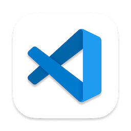
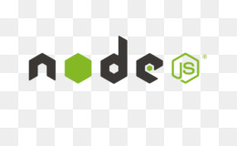
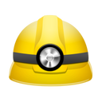

# Go-Stack_rocketseat.

Maratona intensiva para eu melhorar minhas habilidades 
todo  conteúdo será do bootstrap go stack 11.

### Pull request.

Os pull request são bem vindos, só que lembrem-se de se sertificar se 
realmente tem um problema.

## Para que o go stack ??

O bootstrap da rocketseat é uma boa maneira de aprender a fazer sites modernos 
e com uma boa funcionalidade. Além de proporsionar um ótiomo ensino, eles aindam dão 
dicas de como ser mais produtivos e falam de alguns recursos bem úteis.

## Ferramentas usadas.

### Visual studio code

  

Estarei usando o vs code pois é um dos melhores apps para desenvolver as 
aplicações de códigos e tudo mais.

### Insomnia   

  

Utilizarei o insomnia porque é a melhor ferramenta de testes com localhost,
tem uma boa interface e ainda para fazer uns testes com json.

### Node 
 

  

O node eu vou usar para fazer o javascript rodar no meu pc .

### DevDocs

  

Essa ferramenta é para quando eu quiser saber para que serve aquela linguagem
ou como fazer aquele efeito na tela etc...

